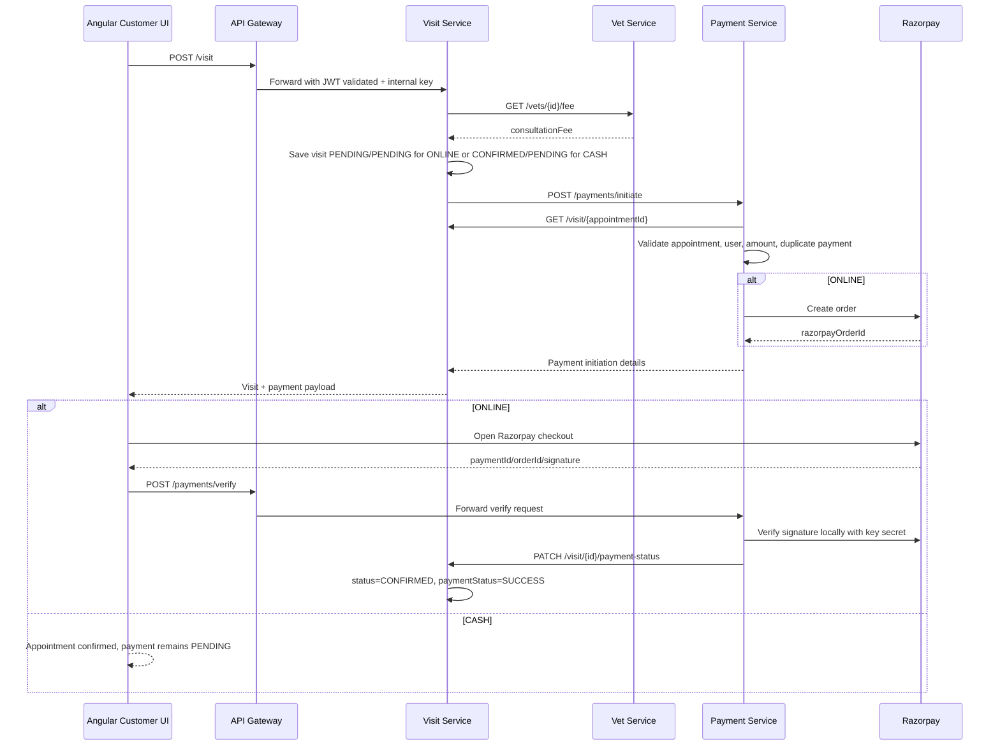

# PamperPaws Payment Integration

## Booking Flow



## Example Requests

Create online appointment:

```http
POST /visit
Authorization: Bearer <jwt>
Content-Type: application/json

{
  "customerId": 1,
  "vetId": 2,
  "petId": 4,
  "visitDate": "2026-05-10",
  "timeSlot": "10 AM - 11 AM",
  "reason": "Vaccination",
  "paymentMethod": "ONLINE"
}
```

Response includes a pending visit and Razorpay order:

```json
{
  "id": 15,
  "customerId": 1,
  "vetId": 2,
  "petId": 4,
  "status": "PENDING",
  "paymentMethod": "ONLINE",
  "paymentStatus": "PENDING",
  "consultationFee": 500,
  "payment": {
    "paymentId": 8,
    "appointmentId": 15,
    "amount": 500,
    "razorpayOrderId": "order_xxx",
    "razorpayKeyId": "rzp_test_xxx",
    "currency": "INR"
  }
}
```

Verify payment:

```http
POST /payments/verify
Authorization: Bearer <jwt>
Content-Type: application/json

{
  "appointmentId": 15,
  "razorpayOrderId": "order_xxx",
  "razorpayPaymentId": "pay_xxx",
  "razorpaySignature": "signature_from_checkout"
}
```

Cash appointment uses the same `/visit` API with `"paymentMethod": "CASH"` and returns `status=CONFIRMED`, `paymentStatus=PENDING`.

## Required `.env` Values

Payment Service:

```properties
SERVER_PORT=8086
DB_URL=jdbc:mysql://localhost:3306/pamperpaws_payment
DB_USERNAME=root
DB_PASSWORD=
RAZORPAY_KEY_ID=
RAZORPAY_KEY_SECRET=
RAZORPAY_CURRENCY=INR
EUREKA_SERVER_URL=http://localhost:8761/eureka
INTERNAL_SERVICE_KEY=pamper-paws-internal-dev-key
```
